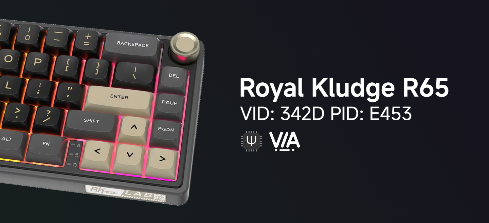

# Royal Kludge R65 + QMK&VIA (with SnapTap/SOCD mod)



**⚡ QMK+VIA version | [SignalRGB version](https://github.com/irfanjmdn/r65/signalrgb/master)**
---

Here you'll find everything you need for the RK65:

- Firmware
- Keymaps
- PCB Diagram

## DISCLAIMER

**This branch only contains files for the WIRED version of the Royal Kludge R65 (ANSI layout). For the ISO layout or other Royal Kludge keyboard variants, visit sdk66’s [QMK Firmware Repository](https://github.com/hangshengkeji/qmk_firmware/tree/master/keyboards/rk).**

To developers who would want to contribute, any and all help would be greatly appreciated! Feel free to submit improvements, fixes, or suggestions.

---

## Overview

The Royal Kludge RKR65 is a 66-key RGB backlit keyboard with Chartreuse, Brown, or Blue switches. It offers a gasket structure for a soft typing experience, knob adjustment, firmware updates, ergonomic design, and hot-swappable keys.

When I bought this keyboard, I was told it was open source by the seller, but they never gave out the files on their website. After weeks of emails and follow-ups, I finally received the QMK firmware for the Royal Kludge R65. Special thanks to [sdk66](https://github.com/sdk66) for sharing these files!

## Known Issues

- [ ] **Caps Lock Indicator Light**: The Caps Lock indicator light doesn't turn on. This issue is fixable, but I’m not experienced enough to handle it.
- [ ] **RGB Light Effects**: RGB light effects might be slightly misaligned.
#### For a fully functional firmware without issues, [flash](#flashinginstalling-the-firmware) the [original firmware file](Original%20RK%20R65%20Firmware%2020240311.hex). We don't have the source for this specific precompiled file, unfortunately.

## Guide

### Building the Firmware

1. **Install QMK MSYS**  
   Download and install [QMK MSYS](https://msys.qmk.fm).

2. **Set Up QMK MSYS**  
   Open QMK MSYS and run the command:  
   ```bash
   qmk setup
   ```
   A folder will be installed at `C:/Users/%USERNAME%/qmk_firmware`.

3. **Add Keyboard Files**  
   Download this repository and move the `rk/r65` folder into your `qmk_firmware/keyboards/` folder.

4. **Compile the Firmware**  
   Run the following command in QMK MSYS:  
   ```bash
   qmk compile -kb rk/r65 -km via
   ```  
   (Available options: default/via/via-socd).

5. **Locate the Firmware File**  
   Find the compiled `.bin` or `.hex` file in the root of the `qmk_firmware` folder.

### Flashing/Installing the Firmware

1. **Install QMK Toolbox**  
   Download and install [QMK Toolbox](https://github.com/qmk/qmk_toolbox/releases).

2. **Load the Firmware File**  
   Open QMK Toolbox and load the `.bin` or `.hex` file.

3. **Enter Bootloader Mode**  
   Reset the keyboard into bootloader mode.

4. **Flash the Firmware**  
   Click 'Flash', then 'Exit DFU' once the flashing process is complete.

### Entering Bootloader Mode

- **Option 1**: Hold the Reset switch on the PCB while connecting the USB cable.
- **Option 2**: Hold the Escape key while connecting the USB cable (this will also erase settings).
- **Option 3**: Press `Fn+Shift+Esc`.

