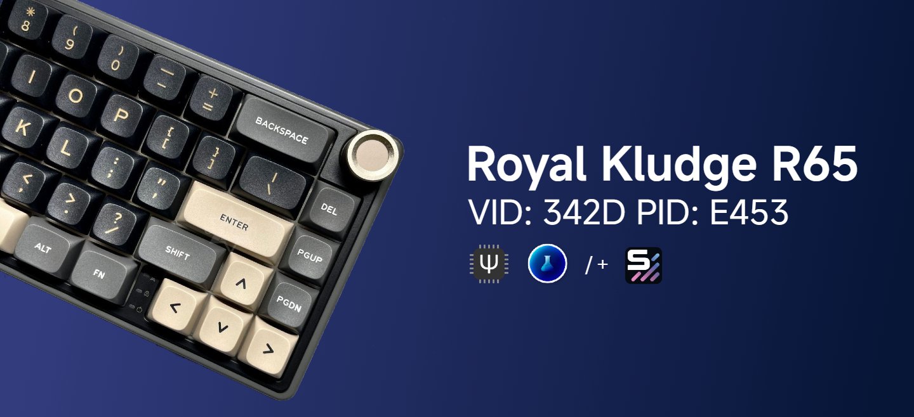

# 🧪🚦 Royal Kludge R65 with Vial/VialRGB



### Branches

| Branch        | Features              | Description                                             | Link                                                                                   |
|---------------|-----------------------|---------------------------------------------------------|----------------------------------------------------------------------------------------|
| Master   | QMK, VIA      | The main branch *(with optional Snap Tap feature[^1][^2])*.           | [View on GitHub](https://github.com/irfanjmdn/r65/tree/master)                         |
| SignalRGB | QMK, VIA + SignalRGB | Stable branch with VIA and SignalRGB support.     | [View on GitHub](https://github.com/irfanjmdn/r65/tree/signalrgb)                      |
| VialRGB       | QMK, VIA, Vial /+ SignalRGB      | Experimental branch with Vial and Vial+SignalRGB.    | **You are here**                                                      |

---


## ❓ VIA, Vial, and VialRGB: What's the Difference?
- **VIA**: An easy-to-use, popular, but closed-source GUI for keyboard layout customization. VIA only supports basic remapping, RGB, and default layers.
- **Vial**: An open-source fork of VIA with more features.[^3] Vial includes features like [Tap Dance](https://get.vial.today/manual/tap-dance.html), combos, and key overrides. [👨‍🏫 Guide for noobs](https://get.vial.today/manual/first-use.html)
- **VialRGB**: Includes all the features mentioned above, but has [SignalRGB](https://signalrgb.com/) support. [⚠ Known Issues](https://github.com/irfanjmdn/r65/tree/vialrgb#known-issues)

---

## ⚠ DISCLAIMER ⚠

This branch only contains files for the **wired ANSI-layout** version of the Royal Kludge R65. Please review the full [disclaimer](DISCLAIMER.md) before using the files provided in this repository.

- ⌨ 🔌 For the **ISO layout** or other Royal Kludge keyboard variants, visit sdk66’s [QMK Firmware Repo](https://github.com/hangshengkeji/qmk_firmware/tree/master/keyboards/rk).
- ⌨ 🛠 For a more **customized** version of the firmware for the R65, visit iamdanielv's [R65 Custom Firmware Repo](https://github.com/iamdanielv/kb_rk_r65).

To developers who would want to contribute, any and all help would be greatly appreciated! Feel free to submit improvements, fixes, or suggestions.

---

## Known Issues

### Using SignalRGB & Vial simultaneously

Please note that SignalRGB and Vial cannot run simultaneously. To avoid conflicts:

- Close Vial or its browser tab before running SignalRGB.
- Alternatively, close SignalRGB before using Vial.

The issue arises because both use the `raw_hid_receive` solution, causing interference.

---

## Firmware Options

Make sure to read the [guide](https://github.com/irfanjmdn/r65/tree/vialrgb#guide) before proceeding.

| **Option**                          | **Command**                          | **Vial** | **SignalRGB** | **SOCD[^1]** | **Download prebuilt firmware** |
|-------------------------------------|--------------------------------------|---------|---------------|--------------|--------------------------------|
| **Vial Only**                       | `make rk/r65 -km vial`               | ✅      | ⬜            | ⬜            | [⏬Download](https://github.com/irfanjmdn/r65/blob/vialrgb/%5BFW0.1.0%20RKR65%5D%20Vial%20only.hex)          |
| **Vial with SOCD**                  | `make rk/r65 -km vial-socd`          | ✅      | ⬜            | ✅            | [⏬Download](https://github.com/irfanjmdn/r65/blob/vialrgb/%5BFW0.1.0%20RKR65%5D%20Vial%20with%20SOCD.hex)          |
| **VialRGB** [⚠ Known Issues](https://github.com/irfanjmdn/r65/tree/vialrgb#known-issues) | `make rk/r65 -kb rk/r65 -km vialrgb` | ✅      | ✅            | ⬜            | [⏬Download](https://github.com/irfanjmdn/r65/blob/vialrgb/%5BFW0.1.0%20RKR65%5D%20VialRGB.hex)          |
| **VialRGB with SOCD** [⚠ Known Issues](https://github.com/irfanjmdn/r65/tree/vialrgb#known-issues) | `make rk/r65 -kb rk/r65 -km vialrgb-socd` | ✅ | ✅ | ✅ | [⏬Download](https://github.com/irfanjmdn/r65/blob/vialrgb/%5BFW0.1.0%20RKR65%5D%20VialRGB%20with%20SOCD.hex) |

---

## Guide

### Building the Firmware

For more information, visit [SignalRGB/building-firmware-from-source](https://docs.signalrgb.com/qmk/building-firmware-from-source).

#### 🧪 **For Vial Only Firmware**

1. **Install QMK MSYS**  
   Download and install [QMK MSYS](https://msys.qmk.fm).

2. **Set Up QMK MSYS for Vial**  
   Open QMK MSYS and run these commands:  
   ```bash
   mkdir Vial
   cd Vial
   git clone https://github.com/vial-kb/vial-qmk
   cd vial-qmk
   ```
   A folder will be installed at `C:/Users/%USERNAME%/Vial/vial-qmk`.

3. **Add Keyboard Files**  
   [Download this repository](https://minhaskamal.github.io/DownGit/#/home?url=https://github.com/irfanjmdn/r65/tree/vialrgb/rk/r65) and move the `rk/r65` folder into your `vial-qmk/keyboards/` folder.

4. **Compile the Firmware**  
   Run the following command in QMK MSYS:  
   ```bash
   make rk/r65:vial
   ```  
   (Available options: default/vial/vial-socd).

5. **Locate the Firmware File**  
   Find the compiled `.bin` or `.hex` file in the root of the `vial-qmk` folder.

#### 🧪💡 **For VialRGB (Vial + SignalRGB) Firmware**

1. **Install QMK MSYS**  
   Download and install [QMK MSYS](https://msys.qmk.fm).

2. **Set Up QMK MSYS**  
   Open QMK MSYS and run these commands:  
   ```bash
   mkdir VialRGB
   cd VialRGB
   git clone https://github.com/SRGBmods/VialQMK
   cd VialQMK
   ```
   A folder will be installed at `C:/Users/%USERNAME%/Vial/VialQMK`.

3. **Add Keyboard Files**  
   [Download this repository](https://minhaskamal.github.io/DownGit/#/home?url=https://github.com/irfanjmdn/r65/tree/vialrgb/rk/r65) and move the `rk/r65` folder into your `VialQMK/keyboards/` folder.

4. **Compile the Firmware**  
   Run the following command in QMK MSYS:  
   ```bash
   make rk/r65:vialrgb
   ```  
   (Available options: vialrgb/vialrgb-socd).

5. **Locate the Firmware File**  
   Find the compiled `.bin` or `.hex` file in the root of the `VialQMK` folder.

### Flashing/Installing the Firmware

1. **Install QMK Toolbox**  
   Download and install [QMK Toolbox](https://github.com/qmk/qmk_toolbox/releases).

2. **Load the Firmware File**  
   Open QMK Toolbox and load the `.bin` or `.hex` file.

3. **Enter Bootloader Mode**  
   Reset the keyboard into bootloader mode.

4. **Flash the Firmware**  
   Click 'Flash', then 'Exit DFU' once the flashing process is complete.

### Using Vial

0. **Close any instance of VIA/SignalRGB.**

1. **Open Vial**
   Go to https://vial.rocks and connect your keyboard.

2. **Use Vial**
   Use Vial and enjoy.

### Setting up SignalRGB

0. **Close any instance of Vial.**

1. **Install SignalRGB**  
   Download and install the [SignalRGB software](https://signalrgb.com/download/).

2. **Move Plugin File**  
   After installing, copy [`SignalRGB-for-RK-R65.js`](SignalRGB%20for%20RK%20R65.js) to `%userprofile%/Documents/WhirlwindFX/plugins`.

3. **Restart SignalRGB**  
   Restart SignalRGB and enjoy.

### Entering Bootloader Mode

- **Option 1**: Hold the Reset switch on the PCB while connecting the USB cable.
- **Option 2**: Hold the Escape key while connecting the USB cable (this will also erase settings).
- **Option 3**: Press `Fn+Shift+Esc`.

[^1]: Snap Tap/SOCD is a feature that prioritizes the latest input between two selected keys without the need to release the previous one, allowing for faster directional changes. This can enhance gameplay in FPS games by enabling quicker counter-strafing and more responsive movements. 
[^2]: The Snap Tap/SOCD feature is available in every branch of the repository.
[^3]: You should use Vial if you have experience with QMK/VIA. If you are new to modifying keyboards, I recommend you [use VIA](https://usevia.app) instead. 
